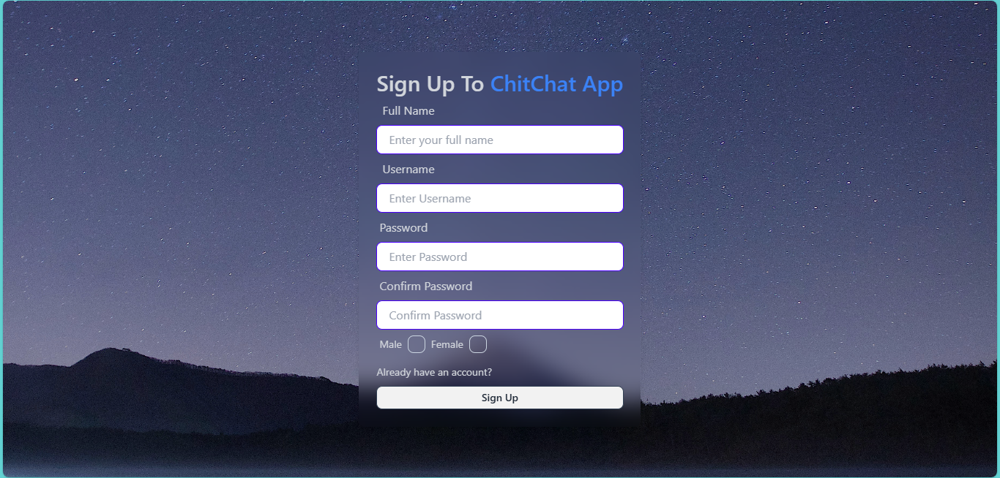
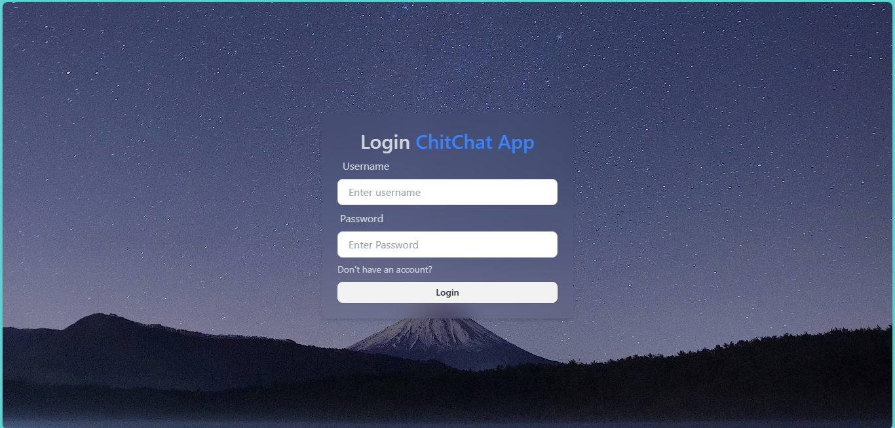
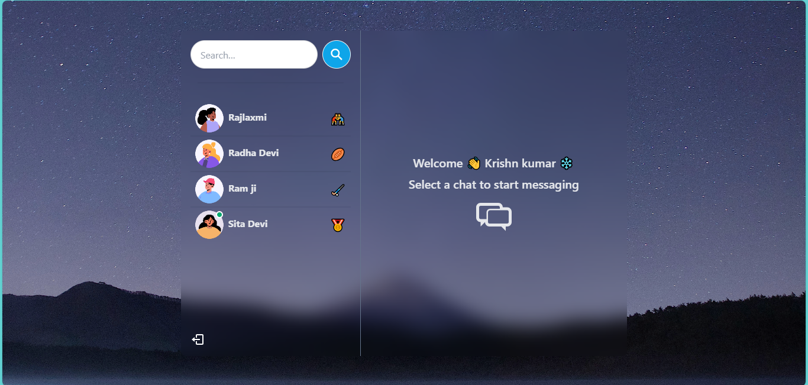
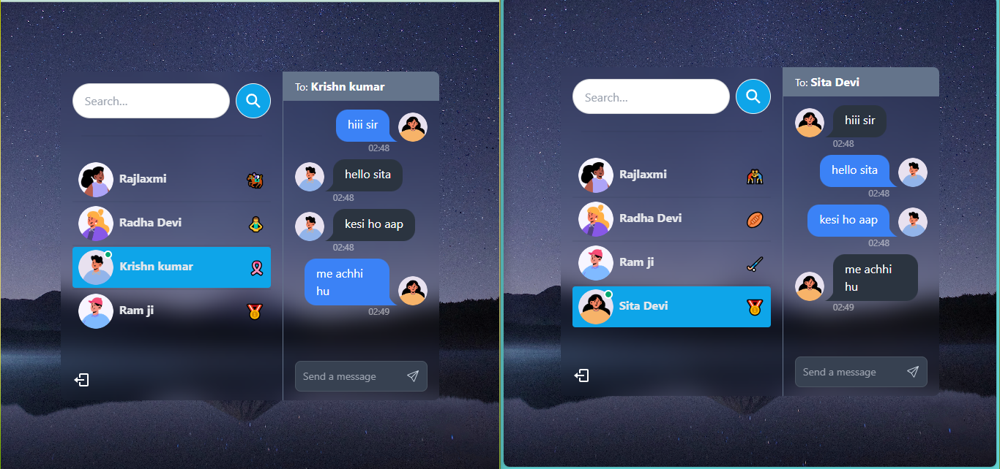
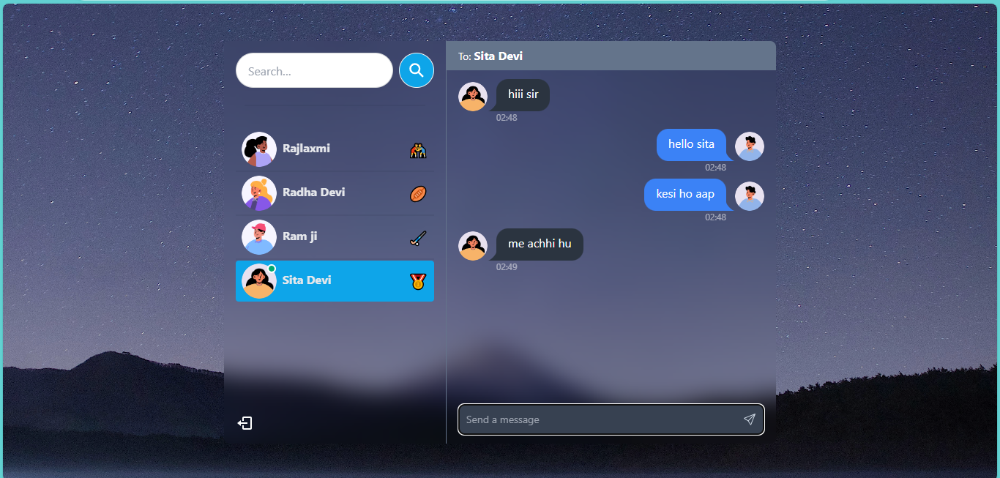

# ChitChat-App
This is a real-time chat application built using React, Express, and WebSocket. It supports user authentication, private messaging, live updates, and a user search feature.

## Features
- **User Authentication:** Secure login and registration system.
- **Logout:** Logout feature allows users to securely log out of their account.
- **Welcome Page:** Personalized welcome page after login.
- **Real-time Messaging:** Instant messaging with WebSocket technology.
- **Private Chat:** Chat with other users privately.
- **User Search:** Search bar to find users by username.
- **User Status:** See who is online or offline.
- **Notification Sound:** Audio alert when a new message arrives.
- **Chat Timestamps:** Display the time each message was sent and received.
- **Responsive Design:** Works on both desktop and mobile devices.

  ## Tech Stack
- **Frontend:** React.js, HTML, CSS
- **Backend:** Node.js, Express.js
- **WebSocket:** Socket.io
- **Database:** MongoDB
- **Authentication:** JWT (JSON Web Tokens)
- **State Management:** React Context API
- **Environment Variables:** dotenv

## Screenshots
### Signup Page
 

### Login Page
 

### Welcome Page

### Chat Interface

